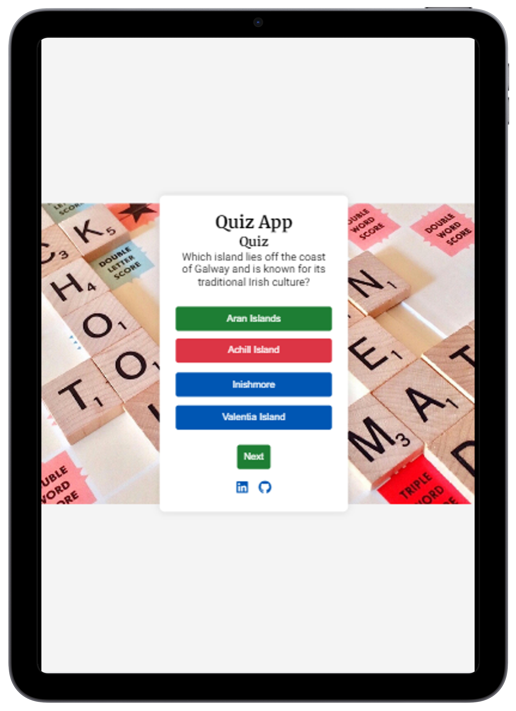
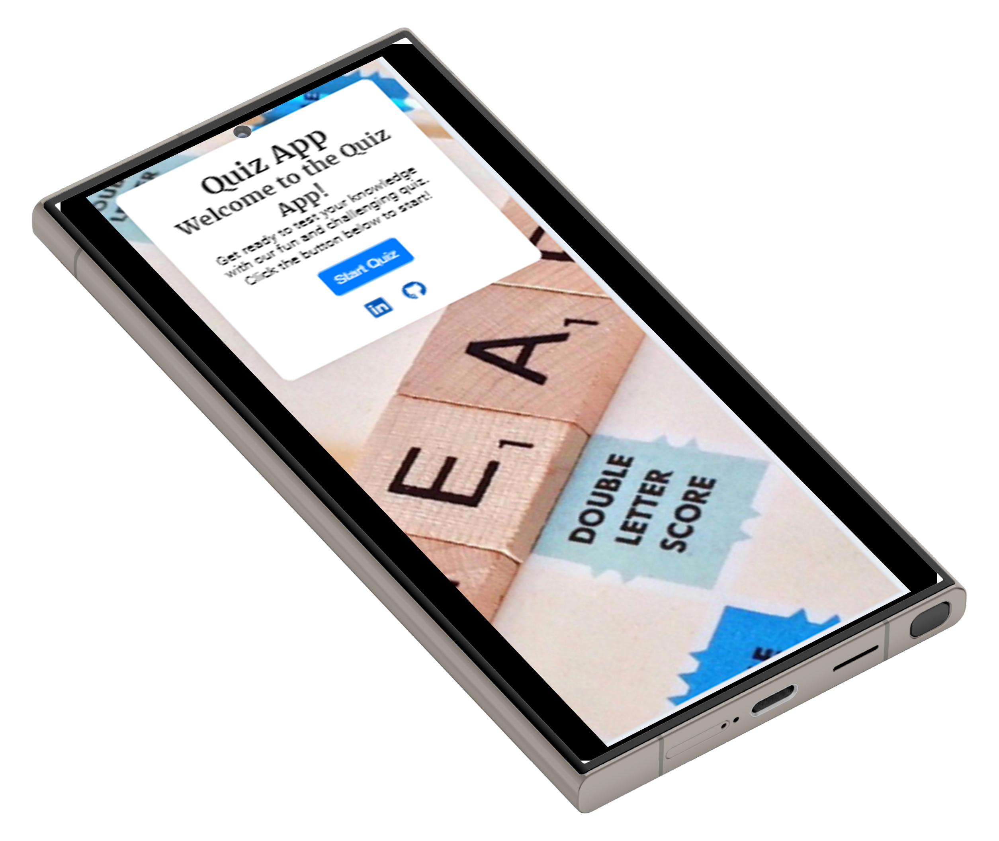

Site Overview
The Quiz-App is an engaging and educational tool designed to offer users a fun and interactive way to test and expand their knowledge across various subjects. Whether you're looking to challenge yourself, learn something new, or simply pass the time, Quiz-App provides a user-friendly platform to do so.

Inspiration
The idea for Quiz-App was born out of a passion for learning and the joy of discovering new facts. Just like a trivia night with friends, this app aims to recreate the excitement and satisfaction that comes with answering questions correctly and learning from mistakes.

## Screenshots

  

    
    
Laptop Front Screen

  

  

    
    
Desktop Front Screen

  

  

    
    
Airpad Portrait Screen

  

  

    
    
Samsung Right Screen

  

