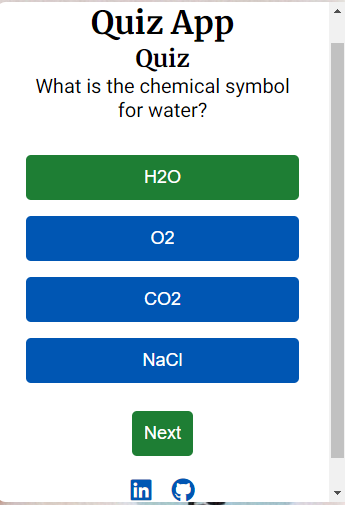
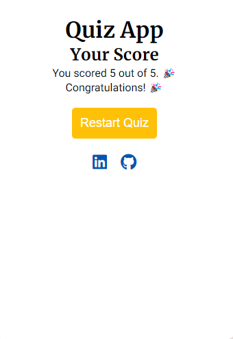

## Quiz-App Game

### Site Overview

The Quiz-App is an engaging and educational tool designed to offer users a fun and interactive way to test and expand their knowledge across various subjects. Whether you're looking to challenge yourself, learn something new, or simply pass the time, Quiz-App provides a user-friendly platform to do so.

#### Inspiration

The idea for Quiz-App was born out of a passion for learning and the joy of discovering new facts. Just like a trivia night with friends, this app aims to recreate the excitement and satisfaction that comes with answering questions correctly and learning from mistakes.

### Screenshots

| Description | Screenshot |
| --- | --- |
| Laptop Front Screen | [screenshot](assets/images/laptop-front.png) |
| Desktop Front Screen | [screenshot](assets/images/Desktop-front.png) |
| Airpad Portrait Screen | [screenshot](assets/images/airpad-portrait.png) |
| Samsung Right Screen | [screenshot](assets/images/sumsung-right.png) |

### Features

#### Header
- **Quiz App**: Displays the title of the application prominently.

#### Welcome Section
- **Introduction Message**:
  - Welcomes users to the Quiz App.
  - Provides an engaging introduction, highlighting the excitement and challenge of the quiz.
  - Informs users that each quiz attempt will present new and unique questions.

#### Start Quiz
- **Interactive Start Button**:
  - Users can begin their quiz adventure by clicking the "Start Quiz" button.

#### Game Options
- **Quiz Section**:
  - **Question Display**: Presents the current quiz question.
  - **Options Display**:
    - Users can select their answer from the provided options.
    - Example Question: "What is the capital of France?"
      - Option 1: Berlin
      - Option 2: Madrid
      - Option 3: Paris
      - Option 4: Lisbon
  - **Next Button**: Allows users to proceed to the next question after selecting an answer.
  

#### Quiz Result
- **Score Display**:
  - **Message**: Shows the user's score with a celebratory message if the score is perfect.
  - Example: "You scored 5 out of 5. 🎉 Congratulations! 🎉"
- **Restart Quiz**:
  - **Interactive Restart Button**: Allows users to restart the quiz for another attempt.
  

### Future Enhancements

#### Timed Questions
- **Feature**: Implement a timer for each question to add an element of urgency and challenge.
- **Benefit**: Increases the difficulty and excitement of the quiz.

#### Question Categories
- **Feature**: Allow users to select categories (e.g., History, Science, Sports).
- **Benefit**: Provides a personalized quiz experience based on user preferences.

#### Leaderboard
- **Feature**: Display a leaderboard with the highest scores.
- **Benefit**: Encourages competition among users and enhances replayability.

#### Multiplayer Mode
- **Feature**: Introduce a multiplayer mode where users can compete against friends in real-time.
- **Benefit**: Adds a social dimension to the quiz, making it more engaging.

#### Feedback and Explanations
- **Feature**: Provide feedback and explanations for each question after it is answered.
- **Benefit**: Enhances the educational value of the quiz by explaining correct and incorrect answers.

#### Question Difficulty Levels
- **Feature**: Allow users to choose between different difficulty levels (e.g., Easy, Medium, Hard).
- **Benefit**: Makes the quiz accessible to users with different knowledge levels.

#### Progress Tracking
- **Feature**: Track user progress over time, showing improvements and statistics.
- **Benefit**: Motivates users by showing their growth and areas for improvement.

#### Custom Quizzes
- **Feature**: Let users create and share their own quizzes.
- **Benefit**: Expands the content available and allows for community engagement.

#### Audio Questions
- **Feature**: Include audio-based questions where users have to listen to a clip and answer.
- **Benefit**: Diversifies question types and engages different senses.

#### Adaptive Learning
- **Feature**: Implement adaptive learning algorithms to tailor the difficulty and types of questions based on user performance.
- **Benefit**: Provides a customized learning experience that adapts to the user's strengths and weaknesses.

### Testing

#### Browser Compatibility
I tested the Quiz-App across several browsers to ensure consistent performance and appearance:
- **Google Chrome**
- **Mozilla Firefox**
- **Safari**

#### Results Accuracy
- I confirm that the game results are always correct across different browsers.

#### Readability
- **Header, Instructions, Options, and Result**:
  - I confirm that these elements are all readable and easy to understand.

#### Accessibility
- **Colors and Fonts**:
  - I confirm that the colors and fonts chosen are easy to read.
  - Accessibility was verified using Lighthouse in Chrome DevTools, ensuring that the application meets accessibility standards.
  

### Technologies Used
- HTML
- CSS
- JavaScript

### Bugs

#### Solved Bugs
- When using Wave evaluation to check each page, there were errors related to Arial. These were fixed as follows:
  ```html
  <a href="https://www.github.com/desmond0147" target="_blank" rel="noopener" aria-label="Visit our GitHub page (opens in new tab)">
    <i class="fab fa-github" aria-hidden="true"></i>
  </a>

  The low contrast issue was fixed through DevTools.

## Validation Testing
HTML: No errors were returned when passing through the official W3C validator, wave evaluation tools.
CSS: No errors were found when passing through the official Jigsaw validator.
Unfixed Bugs
No unfixed bugs.
Accessibility
- I confirmed that the colors and fonts chosen are easy to read.
- The image performance is also good, as confirmed by running it through Lighthouse in DevTools.

## Getting Started
- This section provides instructions on how to set up and run the project locally, as well as an overview of the deployment process.

- Setting Up Locally
To run this project locally:

- Clone the repository: Start by cloning the repository to your local machine using the following command:
git clone https://desmond0147.github.io/Quiz-App/
- Navigate to the project directory: Change into the project directory: Quiz-App
## Open the project: Open index.html in your web browser to view the site:
open index.html

# Deployment Process
The project is deployed to GitHub Pages, which is a static site hosting service that takes files from a GitHub repository and serves them as a website.

Here are the steps followed to deploy the project:

- Create a repository on GitHub: A new repository named Quiz-App was created on GitHub.
- Link the repository to Gitpod: The GitHub repository was linked to a Gitpod workspace for an integrated development environment that supports running the project directly in the browser.
- Develop the project: The project was developed within the Gitpod environment, making use of its features for writing, testing, and debugging the code.
- Commit and push changes: Changes were committed and pushed to the GitHub repository regularly using the following commands:
git add .
git commit -m "Commit message describing the changes"
git push

## Deploy to GitHub Pages
From the source drop-down menu, select the Master Branch.
Once the master branch has been selected, the page provides the link to the completed website: QUIZ-APP GitHub Pages https://desmond0147.github.io/Quiz-App/.

## Credits
- Inspiration: Love Maths walkthrough project, ChatGPT for generating questions and answers, Google, YouTube: GreatStackDev, "mentor call sections".
- Media: Images were taken from Pexels. Favicon: Favicon. Redketchup.io was used to resize images. This code was taken directly from Love Maths project:
javascript
document.addEventListener("DOMContentLoaded", function() {
  const optionButtons = document.querySelectorAll(".option");
  for (let button of optionButtons) {
      button.addEventListener("click", function() {
          checkAnswer(parseInt(this.getAttribute("data-index")));
      });
  }
});
The code to fix the Arial issues was taken from W3Schools.
## License
This project is licensed under the MIT License.